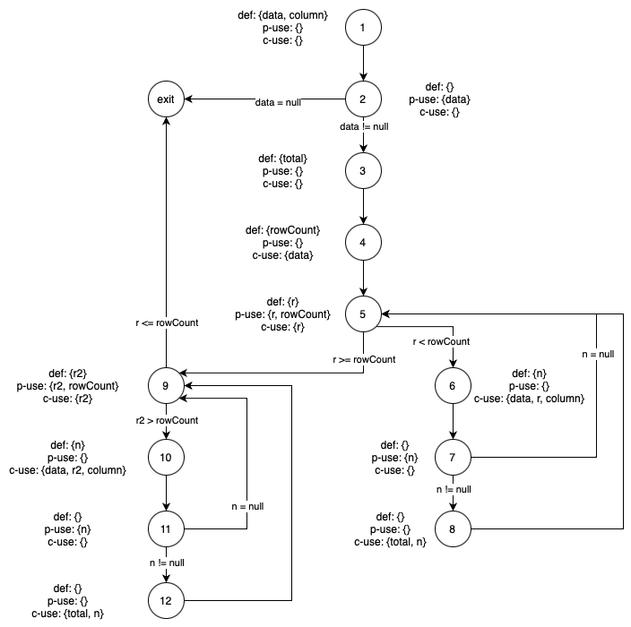
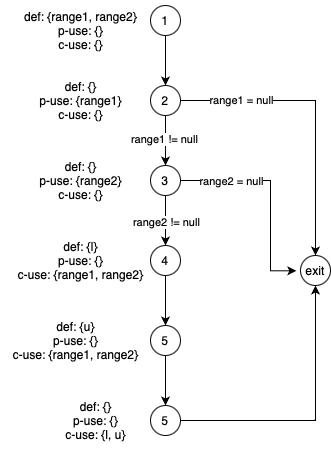
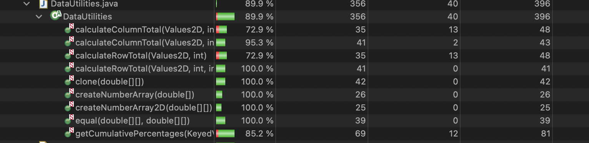
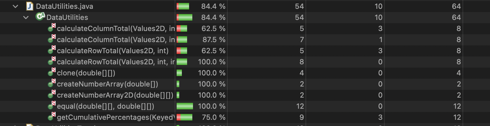
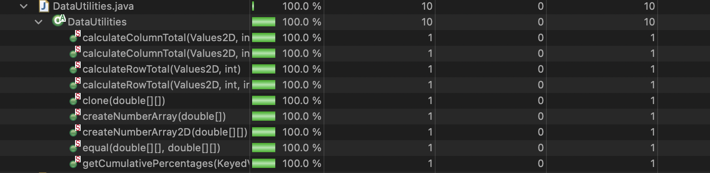
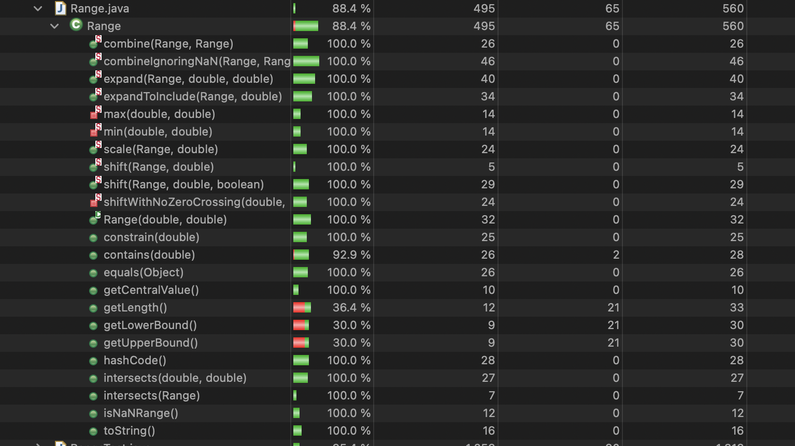
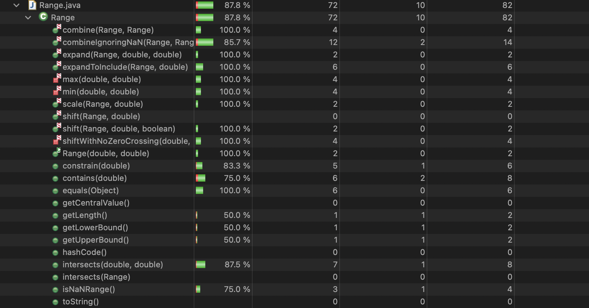
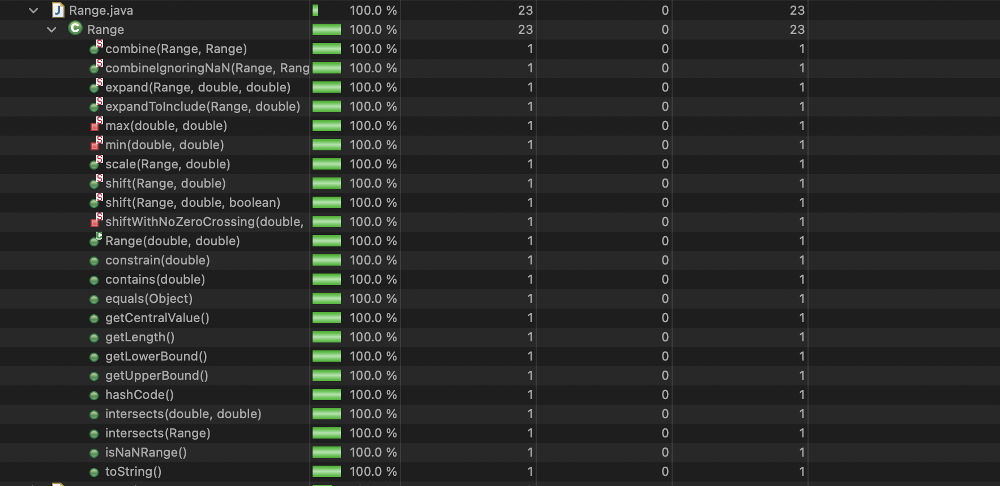

**SENG 438 - Software Testing, Reliability, and Quality**

**Lab. Report #3 – Code Coverage, Adequacy Criteria and Test Case Correlation**

| Group \#:  1         |
| --------------     |
| Dominic Gartner    |
| Hamd Khan          |
| Alexander Mclean   |
| Noel Thomas        |

(Note that some labs require individual reports while others require one report
for each group. Please see each lab document for details.)

# 1 Introduction

This assignment advanced from the previous work on the JFreeChart program, transitioning from black-box to white-box testing methodologies. While the earlier assignment concentrated on black-box testing, emphasizing functional verification without regard to internal workings, this phase focused on understanding and applying white-box testing principles. We enhanced our grasp of how measuring code coverage aids in formulating more precise test cases. Specifically, we incorporated the EclEmma code coverage tool within our Eclipse/JUnit testing framework, gaining insights into white-box testing's utility alongside other methodologies to thoroughly assess a program's readiness for deployment.

# 2 Manual data-flow coverage calculations for X and Y methods

## DataUtilities.calculateColumnTotal

### DFG

    

### DU Sets

| Statement | Code | DU Sets
| ------------- |:---------------:| :---------------:|
| 1 | public static double calculateColumnTotal(Values2D data, int column) | data: {(1,2), (1, 4), (1, 6), (1, 10)}, column: {(1, 6), (1, 10)}
| 2 | ParamChecks.nullNotPermitted(data, "data"); | data: {(1, 2)}
| 3 | double total = 0.0; | total: {(3, 8), (3, 12)}
| 4 | int rowCount = data.getRowCount(); | data: {(1, 4)}, rowCount: {(4,5), (4,9)}
| 5 | for (int r = 0; r < rowCount; r++) | rowCount: {(4,5)}, r: {(5, 5), (5, 6)}
| 6 | Number n = data.getValue(r, column); | data: {(1, 6)}, column: {(1, 6)}, r: {(5, 6)}, n: {(6, 7), (6, 8)}
| 7 | if (n != null) | n: {(6, 7)}
| 8 | total += n.doubleValue(); | total: {(3, 8)}, n: {(6, 8)}
| 9 | for (int r2 = 0; r2 > rowCount; r2++) | rowCount: {(4, 9)}, r2: {(9, 9), (9, 10)}
| 10 | Number n = data.getValue(r2, column); | data: {(1, 10)}, column: {(1, 10)}, n: {(10, 11)}, r2: {(9, 10)}
| 11 | if (n != null) | n: {(10, 11)}
| 12 | total += n.doubleValue(); | total: {(3, 12)}, n: {(10, 12)}

### DU-Pairs

*data*: (1,2), (1, 4), (1, 6), (1, 10)

*column*: (1, 6), (1, 10)

*total*: (3, 8), (3, 12)

*rowCount*: (4, 5), (4, 9)

*r*: (5, 5), (5, 6)

*n*: (6, 7), (6, 8), (10, 11), (10, 12)

*r2*: (9, 9), (9, 10)

### DU-Pairs per Test

> Important Note: calculateColumnTotal never goes into the second loop, unless rowCount is negative. This triggers an infinite loop.

calculateColumnTotalForTwoValues

du(1, 2, data), du(1, 4, data), du(1, 6, data)

du(1, 6, column)

du(3, 8, total)

du(4, 5, rowCount), du(4, 9, rowCount)

du(5, 5, r), du(5, 6, r)

du(6, 7, n), du(6, 8, n)

du(9, 9, r2)

calculateColumnTotalFor5NegativeValues

du(1, 2, data), du(1, 4, data), du(1, 6, data)

du(1, 6, column)

du(3, 8, total)

du(4, 5, rowCount), du(4, 9, rowCount)

du(5, 5, r), du(5, 6, r)

du(6, 7, n), du(6, 8, n)

du(9, 9, r2)

calculateColumnTotalForMixedPositiveAndNegativeValues

du(1, 2, data), du(1, 4, data), du(1, 6, data)

du(1, 6, column)

du(3, 8, total)

du(4, 5, rowCount), du(4, 9, rowCount)

du(5, 5, r), du(5, 6, r)

du(6, 7, n), du(6, 8, n)

du(9, 9, r2)

calculateColumnTotalForEmptyData

du(1, 2, data), du(1, 4, data)

du(3, exit, total)

du(4, 5, rowCount), du(4, 9, rowCount)

du(5, 5, r)

du(9, 9, r2)

calculateColumnTotalForLargeNumberOfRows

du(1, 2, data), du(1, 4, data), du(1, 6, data)

du(1, 6, column)

du(3, 8, total)

du(4, 5, rowCount), du(4, 9, rowCount)

du(5, 5, r), du(5, 6, r)

du(6, 7, n), du(6, 8, n)

du(9, 9, r2)

calculateColumnTotalThatContainsANullValue

du(1, 2, data), du(1, 4, data), du(1, 6, data)

du(1, 6, column)

du(3, 8, total)

du(4, 5, rowCount), du(4, 9, rowCount)

du(5, 5, r), du(5, 6, r)

du(6, 7, n), du(6, 8, n)

du(9, 9, r2)

calculateColumnTotalThatContainsInvalidColumnIndex

du(1, 2, data), du(1, 4, data), du(1, 6, data)

du(1, 6, column)

du(3, 8, total)

du(4, 5, rowCount), du(4, 9, rowCount)

du(5, 5, r), du(5, 6, r)

du(6, 7, n), du(6, 8, n)

du(9, 9, r2)

calculateColumnTotalForLargeColumnIndex

du(1, 2, data), du(1, 4, data), du(1, 6, data)

du(1, 6, column)

du(3, 8, total)

du(4, 5, rowCount), du(4, 9, rowCount)

du(5, 5, r), du(5, 6, r)

du(6, 7, n), du(6, 8, n)

du(9, 9, r2)

calculateColumnTotalThatContainsNonNullValue

du(1, 2, data), du(1, 4, data), du(1, 6, data)

du(1, 6, column)

du(3, 8, total)

du(4, 5, rowCount), du(4, 9, rowCount)

du(5, 5, r), du(5, 6, r)

du(6, 7, n), du(6, 8, n)

du(9, 9, r2)

testCalculateColumnTotalWithValidValues

du(1, 2, data), du(1, 4, data), du(1, 6, data)

du(1, 6, column)

du(3, 8, total)

du(4, 5, rowCount), du(4, 9, rowCount)

du(5, 5, r), du(5, 6, r)

du(6, 7, n), du(6, 8, n)

du(9, 9, r2)

testCalculateColumnTotalWithNullValues

du(1, 2, data), du(1, 4, data), du(1, 6, data)

du(1, 6, column)

du(3, exit, total)

du(4, 5, rowCount), du(4, 9, rowCount)

du(5, 5, r), du(5, 6, r)

du(6, 7, n), du(6, 8, n)

du(9, 9, r2)

testCalculateColumnTotalWithInvalidRowIndex

du(1, 2, data), du(1, 4, data), du(1, 6, data)

du(1, 6, column)

du(3, 8, total)

du(4, 5, rowCount), du(4, 9, rowCount)

du(5, 5, r), du(5, 6, r)

du(6, 7, n), du(6, 8, n)

du(9, 9, r2)

testCalculateColumnTotalWithTotalGreaterThanZero

du(1, 2, data), du(1, 4, data), du(1, 6, data)

du(1, 6, column)

du(3, 8, total)

du(4, 5, rowCount), du(4, 9, rowCount)

du(5, 5, r), du(5, 6, r)

du(6, 7, n), du(6, 8, n)

du(9, 9, r2)

testCalculateColumnTotalWithNoValidRows

du(1, 2, data), du(1, 4, data), du(1, 6, data)

du(1, 6, column)

du(3, exit, total)

du(4, 5, rowCount), du(4, 9, rowCount)

du(5, 5, r), du(5, 6, r)

du(6, 7, n), du(6, 8, n)

du(9, 9, r2)

### DU-Pair Coverage

DU-Pair Coverage = 12/18 * 100 = 66.67%

This is because the second loop condition was never executed in our test suite as it is infeasable tp test this condition. In this case, r2 is initialized to 0, and the condition to enter the for loop is if r2 > rowCount. However, rowCount can never be negative. Thus, while r2 = 0, r2 can never be greater than rowCount, which is >= 0.

## Range.combine

### DFG

    

### DU Sets per Statement

| Statement | Code | DU Sets
| ------------- |:---------------:| :---------------:|
| 1 | public static Range combine(Range range1, Range range2) | range1: {(1, 2), (1, 4), (1, 5)}, range2: {(1, 3), (1, 4), (1, 5)}
| 2 | if (range1 == null) | range1: {(1, 2)}
| 3 | if (range2 == null) | range1: {(1, 3)}
| 4 | double l = Math.min(range1.getLowerBound(), range2.getLowerBound()); | range1: {(1,4)}, range2: {(1,4)}, l: {4, 6}
| 5 | double u = Math.max(range1.getUpperBound(), range2.getUpperBound()); | range1: {(1, 5)}, range2: {(1, 5)}, u: {5, 6}
| 6 | return new Range(l, u); | l: {4, 6}, u: {5, 6}

### DU-Pairs

*range1*: (1, 2), (1, 4), (1, 5)

*range2*: (1, 3), (1, 4), (1, 5)

*l*: (4, 6)

*u*: (5, 6)

### DU-Pairs per Test

combineValidrangeAndNullRange

du(1, 2, range1)

combineNullrangeAndValidRange

du(1, 2, range1)

du(1, 3, range2)

combineNullRanges

du(1, 2, range1)

combineEmptyRangeAndValidRange

du(1, 2, range1), du(1, 4, range1), du(1, 5, range1)

du(1, 3, range2), du(1, 4, range2), du(1, 5, range2)

du(4, 6, l)

du(5, 6, u)

combineValidRangeAndEmptyRange

du(1, 2, range1), du(1, 4, range1), du(1, 5, range1)

du(1, 3, range2), du(1, 4, range2), du(1, 5, range2)

du(4, 6, l)

du(5, 6, u)

combineEmptyRanges

du(1, 2, range1), du(1, 4, range1), du(1, 5, range1)

du(1, 3, range2), du(1, 4, range2), du(1, 5, range2)

du(4, 6, l)

du(5, 6, u)

combineNonIdenticalEmptyRanges

du(1, 2, range1), du(1, 4, range1), du(1, 5, range1)

du(1, 3, range2), du(1, 4, range2), du(1, 5, range2)

du(4, 6, l)

du(5, 6, u)

combineValidRangeAndSubsetRange

du(1, 2, range1), du(1, 4, range1), du(1, 5, range1)

du(1, 3, range2), du(1, 4, range2), du(1, 5, range2)

du(4, 6, l)

du(5, 6, u)

combineSubsetRangeAndValidRange

du(1, 2, range1), du(1, 4, range1), du(1, 5, range1)

du(1, 3, range2), du(1, 4, range2), du(1, 5, range2)

du(4, 6, l)

du(5, 6, u)

combineTouchingValidRanges

du(1, 2, range1), du(1, 4, range1), du(1, 5, range1)

du(1, 3, range2), du(1, 4, range2), du(1, 5, range2)

du(4, 6, l)

du(5, 6, u)

combineOverlappingValidRanges

du(1, 2, range1), du(1, 4, range1), du(1, 5, range1)

du(1, 3, range2), du(1, 4, range2), du(1, 5, range2)

du(4, 6, l)

du(5, 6, u)

combineIdenticalValidRanges

du(1, 2, range1), du(1, 4, range1), du(1, 5, range1)

du(1, 3, range2), du(1, 4, range2), du(1, 5, range2)

du(4, 6, l)

du(5, 6, u)

### DU-Pair Coverage

DU-Pair Coverage = 8/8 * 100 = 100%

# 3 A detailed description of the testing strategy for the new unit test

Throughout this lab, we detailed our efforts to improve code coverage through white box testing. Our approach involved utilizing metrics such as Instruction Coverage, Branch Coverage, and Method Coverage to guide our actions. We developed new unit tests tailored to specific areas where coverage was lacking, ensuring that all critical instructions, branches, and methods were thoroughly exercised. Additionally, we revisited and refined existing tests to fill any gaps in coverage, fine-tuning them to address previously overlooked sections of the code. Through this effort, we successfully boosted coverage across the board, resulting in a strong improvement in analyzing the Range and Utilities classes. The below test plan illustrates our flow of work. 

### Test Plan for White Box Testing:

### Testing Plan: 
Goal:
Testing two classes, referred to as DataRange and DataUtilities classes, using white box testing techniques.
The objective is to ensure adequate coverage of the code under test, including instruction coverage, method coverage or condition coverage, and branch coverage.
This technique will provide thorough testing of the internal structure of the application.

### Test Coverage Criteria:

Instruction Coverage: Ensures that each line of executable code is executed at least once during testing.
Method Coverage: Verifies that all methods are invoked during testing.
Branch Coverage: Ensures that all possible branches within conditional statements are traversed.

### Testing Team:
Hamd Khan, Dominic Gartner, Noel Thomas, Alex Mclean

### Test Development Approach:

We will all collaborate to design and implement test cases to achieve the desired coverage criteria. Each team member will be responsible for developing test cases for specific components or functionalities.

#### The test development process will involve the following steps:

Initial Analysis: Understanding the current coverage of our previous assignments test cases. Will do this by utilizing ElcEmma coverage statistics
Identification of Test Scenarios: Identifying various scenarios that need to be tested to ensure comprehensive coverage.
Test Case Design: Designing test cases based on identified scenarios, ensuring coverage of all code paths, branches and methods or conditions.
Test Case Implementation: Implementing test cases using the EclEmma testing framework or experimenting with other frameworks for better analysis.
Execution and Analysis: Executing test cases, analyzing results, and identifying areas of improvement.
Iteration: Iteratively refining test cases to achieve better coverage and address any uncovered code paths.

### Test Suite Structure:

The test suite will consist of individual test cases targeting specific functionalities or components of the Range and DataUtilities classes. Each test case will be organized based on its relevance to instruction coverage, method coverage, and branch coverage. Test cases will be grouped into suites for easier management and execution.

### Coverage Goals:

Instruction Coverage: Aim to achieve 90% instruction coverage for both DataUtilities and Range.
Method Coverage (note ElcEmma does not provide condition coverage) : Ensure that all methods within the Range and DataUtilities classes are invoked at least once during testing.
Branch Coverage:  Aim to achieve 70% branch coverage for both DataUtilities and Range.

### Conclusion:

This test plan outlines a structured approach to conducting white box testing for the classes, with the aim of achieving comprehensive coverage and ensuring the reliability and robustness of the given classes.

# 4 A high level description of five selected test cases you have designed using coverage information, and how they have increased code coverage

Range - combineIgnoringWithMaxd2NaNMin()
- This test was used to test the special case of variable d2 being NaN in the private min() function. This function was previously covered through the black box tests exercised in assignment 2, however the case where d2 is NaN was not previously covered. This test calls the combineIgnoringNaN() function, as it uses the min() function as a helper method. This way we were able to effectively test the min() function and achieve increased statement and branch coverage on the method. This test passes in a new Range with NaN values, which are then used in the min() function to determine the min of the Range. This test allowed us to achieve both branch and statement coverage in the min() function. Evaluation of the internal structure of the SUT and consideration of boundary value methodologies allowed us to create this specified test case to increase code coverage.

Range - combineIgnoringWithMaxd2NaNMax()
- This test was used to test the special case of variable d2 being NaN in the private max() function. This function was previously covered through the black box tests exercised in assignment 2, however the case where d2 is NaN was not previously covered. This test calls the combineIgnoringNaN() function, as it uses the max() function as a helper method. This way we were able to effectively test the max() function and achieve increased statement and branch coverage on the method. This test passes in a new Range with NaN values, which are then used in the max() function to determine the max of the Range. This test allowed us to achieve both branch and statement coverage in the max() function. Evaluation of the internal structure of the SUT and consideration of boundary value methodologies allowed us to create this specified test case to increase code coverage.

Range - testEqualsNonRangeObject()
- This test was used to test the equals() function with a non Range Object passed in as the argument. The equals() function in Range.java was not previously tested in our previous assignment. This test allowed us to achieve both increased branch and statement coverage, allowing us to evaluate the "obj instanceof Range" condition to false. This was done through evaluating the structure of the code, as well as considering the boundary value methods which would allow us to test this method effectively and increase code coverage.

Range - testScaleWithNegativeFactor()
- This test was used to test the scale() function with a negative value to scale by. This function was not previously tested in our previous assignment. This test allowed us to achieve both increased branch and statement coverage, allowing us to evaluate if the method properly throws an IllegalArgumentException if factor < 0. This was done through evaluating the structure of the code, as well as considering the boundary value methods which would allow us to test this method effectively and increase code coverage.

DataUtilities - calculateRowTotalForNegativeColumnCount()
- This test was used to test the calculateRowTotal() function in DataUtilities. This method was previously tested in our black box test suite in assignment 2, however this test allowed us to evaluate a branch to true, further increasing both branch and statement coverage. The test was used to return a negative column count, allowing "colCount < 0" to be evaluated true and enter the if statement branch, increasing our test coverage. This was done through evaluating the structure of the code, as well as considering the boundary value methods which would allow us to test this method effectively and increase code coverage.

# 5 A detailed report of the coverage achieved of each class and method (a screen shot from the code cover results in green and red color would suffice)

## DataUtilities

### Statement Coverage Metric

    

Reason for 89.9% Statment Coverage: When testing methods such as calculateColumnTotal(), calculateRowTotal(), and getCumulativePercentages(), three infeasible tests are present, which reduce the ability to achive past 89.9% statement coverage without changing the logic of the code.
In calculateColumnTotal(), total is initialized to 0 and a later if statement checks if total > 0, leading to an infeasible test case as the branch can never evaluate true.
Once again in calculateColumnTotal(), a for loop initializes r2 to 0, and checks if r2 > rowCount. However rowCount can only be >= 0. Therefore another infeasible test is present whwen trying to evaluate the condition of the branch to true, limiting the amount of executable statements able to be tested.

In calculateRowTotal(), a for loop initializes c2 to 0, and checks if c2 > columnCount. However columnCount can only be >= 0. Therefore another infeasible test is present whwen trying to evaluate the condition of the branch to true, limiting the amount of executable statements able to be tested.

In getCumulativePercentages(), i2 is initialized to 0 in a for loop. The condition checked is i2 > data.getItemCount(). However data.getItemCount() >= 0, therefore another infeasible test is present whwen trying to evaluate the condition of the branch to true, limiting the amount of executable statements able to be tested.

### Branch Coverage Metric

    

### Method Coverage Metric

    

## Range

### Statement Coverage Metric

    

Reason for 88.4% Statment Coverage: When testing certain methods in the Range.java class, some infeasible test cases arose. These occured in the getLowerBound(), getUpperBound(), and getLength() functions. Each if these methods have a conditional branch that checks if lower > upper. However, it is infeasible to test this as the Range Constructor checks if lower > upper and throws an IllegalArgumentException if true. Therefore, the creation of a Range object where lower > upper is infeasible, and testing this equality to be true is not possible in the methods specified, leading to a maximum statement coverage of 88.4%.

### Branch Coverage Metric

    

### Method Coverage Metric

    

# 6 Pros and Cons of coverage tools used and Metrics you report

Coverage Tool used: EclEmma

### Pros of EclEmma:

Multiple Coverage Metrics. The tool EcL offers supports various coverage metrics such as line coverage, branch coverage, instruction coverage and method coverage. This allows us as developers to gain insights into different aspects of their code's test coverage and make informed decisions about testing strategies.

Visual Representation: EclEmma provides visual representations of code coverage within the Eclipse IDE, making it easier for developers to interpret and understand the coverage data. This was represented via the table chart with distinct colouring for the coverage of each class

Customizable Reporting: EclEmma allows us as developers to customize coverage reports according to our specific requirements, enabling us to focus on the most relevant metrics and information. For example, we were able to substitute condition coverage with method coverage as advised. 

Integration with Eclipse: EclEmma seamlessly integrates with the Eclipse IDE, making it easy to use and convenient for us developers who are already familiar with the Eclipse environment. Furthermore, it was available directly on the Eclipse marketplace so the installation was very simple and already part of the default setup. 

Real-time Coverage Analysis: EclEmma provides real-time feedback on code coverage, allowing developers to identify areas of code that are not adequately tested and make improvements immediately.

### Cons of EclEmma:

Missing Key Metric:  ElcEmma did not have condition coverage which was a coverage metric we were very interested in and wanted to include in the lab. However it did have alternative coverage metrics which we could use. 

Limited to Java: EclEmma is specifically designed for Java development within the Eclipse IDE, so it may not be suitable for projects using other programming languages or development environments.

Eclipse Dependent: Since EclEmma is tightly integrated with Eclipse, it may not be suitable for developers who prefer using other IDEs or development tools.

Performance Heavy: Like many code coverage tools, EclEmma introduces some performance overhead when running tests, although this overhead is generally minimal and did not significantly impact development workflows.
Lack of Graphical Features: While EclEmma provides basic code coverage analysis capabilities, it may lack some advanced features found in other code coverage tools, such as graphical representation and modelling of the coverage.

Metrics Used: 

- Instruction Coverage
- Branch Coverage 
- Method Coverage

While using EclEmma for code coverage analysis, I utilized three essential metrics to assess the comprehensiveness of testing within the codebase: Instruction Coverage, Branch Coverage, and Method Coverage. Instruction Coverage measures the proportion of executable instructions exercised during testing, offering insight into the granularity of code paths explored. Branch Coverage evaluates the percentage of decision points in the code, ensuring that both true and false outcomes of branches are adequately tested. Meanwhile, Method Coverage assesses the extent to which individual methods or functions are tested, aiding in the identification of potentially overlooked or untested functionalities. By employing this combination of metrics, a more holistic view of the code's test coverage is obtained, facilitating targeted improvements and ensuring the reliability and robustness of the software. We were able to achieve the target measure means for all coverage metrics, however for instruction coverage we achieved a maximum of 88.4%  for range class because achieving 90% was infeasible. Achieving 90% was infeasible due to the fact that it was an inaccessible exception within a lower level function, but this exception would continuously be caught at a higher level in the constructor. Hence, it was not possible to access the code catching the exception in the lower level function.

# 7 A comparison on the advantages and disadvantages of requirements-based test generation and coverage-based test generation.

## Requirements-based test generation
### Pros
- Ensures that the software meets the specified requirements
- Tests the system as a whole, without the constraints of technical knowledge
- Identify errors in the software's logic and functional requirements
- Early detection of functional issues

### Cons
- Requires thorough documentation to communicate the exact functionality of each method in order to develop proper test cases
- May not cover all possible scenarios, especially those not explicitly mentioned in the requirements
- Can be time-consuming and expensive to create tests for complex requirements

## coverage-based test generation
### Pros
- Ensures that all parts of the code are exercised by the tests
- Helps in identifying dead code or unused features
- Helps in identifying areas of the code that may require refactoring or optimization

### Cons
- Never know if all the requirements are covered using only this metric
- Requires knowledge of the internal structure of the SUT to cover all metrics effectively
- Does not guarantee that all requirements are met, as it focuses on code coverage rather than requirements coverage
- Can be complex to implement for certain types of coverage metrics
- Tests may not always be meaningful or relevant to the functionality of the software

# 8 A discussion on how the team work/effort was divided and managed

As a team, we decided to split the work by class. Two members worked on the Range.java class coverage tests while the other two members worked on the DataUtilities.java coverage tests. Once all testing was completed, all members reviewed the work of others, adding comments where needed and fixing any logical errors found. This divided the work load between team members, while achieving effective progress.

# 9 Any difficulties encountered, challenges overcome, and lessons learned from performing the lab

Throughout this assignment, we did not face any major challenges as a group. However, we did face some challenges in communication of which group member is testing which method. In addition to this, learning to work with the new coverage tools was a challenge as all members in the group were unfamiliar with the technology. However, we were able to overcome this challenge through exploration of the technology, including trial and error when testing our methods. We were able to utilize the documentation to learn where to find the different coverage metrics and how to read the results.

# 10 Comments/feedback on the lab itself

As a group we really enjoyed this lab, it was helpful getting us familiar with the testing process, and using some concepts we learned in class in a real time environment. Additionally, we all learned a lot about JUnit test, and how to write them correctly. We found the lab document itself great and very easy to understand. Furthermore, the lab structure allowed for effective learning of testing methodologies and signified the importance of testing in a variety of methods.
