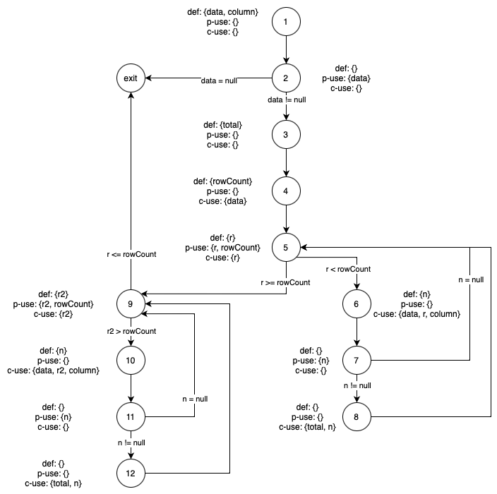
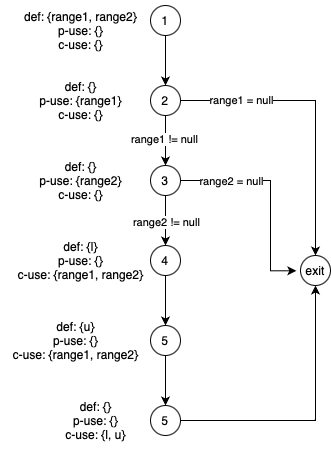

**SENG 438 - Software Testing, Reliability, and Quality**

**Lab. Report #3 – Code Coverage, Adequacy Criteria and Test Case Correlation**

| Group \#:  1         |
| --------------     |
| Dominic Gartner    |
| Hamd Khan          |
| Alexander Mclean   |
| Noel Thomas        |

(Note that some labs require individual reports while others require one report
for each group. Please see each lab document for details.)

# 1 Introduction

This assignment advanced from the previous work on the JFreeChart program, transitioning from black-box to white-box testing methodologies. While the earlier assignment concentrated on black-box testing, emphasizing functional verification without regard to internal workings, this phase focused on understanding and applying white-box testing principles. We enhanced our grasp of how measuring code coverage aids in formulating more precise test cases. Specifically, we incorporated the EclEmma code coverage tool within our Eclipse/JUnit testing framework, gaining insights into white-box testing's utility alongside other methodologies to thoroughly assess a program's readiness for deployment.

# 2 Manual data-flow coverage calculations for X and Y methods

## DataUtilities.calculateColumnTotal

### DFG

    

### DU-Path Sets

### DU-Pairs

*data*

(1,2), (1, 4), (1, 6), (1, 10)

*column*

(1, 6), (1, 10)

*total*

(3, 8), (3, 12)

*rowCount*

(4, 5), (4, 9)

*r*

(5, 5), (5, 6)

*n*

(6, 7), (6, 8), (10, 11), (10, 12)

*r2*

(9, 9), (9, 10)

### DU-Pairs per Test

> Important Note: calculateColumnTotal never goes into the second loop, unless rowCount is negative. This triggers an infinite loop.

calculateColumnTotalForTwoValues

du(1, 2, data), du(1, 4, data), du(1, 6, data)

du(1, 6, column)

du(3, 8, total)

du(4, 5, rowCount), du(4, 9, rowCount)

du(5, 5, r), du(5, 6, r)

du(6, 7, n), du(6, 8, n)

du(9, 9, r2)

calculateColumnTotalFor5NegativeValues

du(1, 2, data), du(1, 4, data), du(1, 6, data)

du(1, 6, column)

du(3, 8, total)

du(4, 5, rowCount), du(4, 9, rowCount)

du(5, 5, r), du(5, 6, r)

du(6, 7, n), du(6, 8, n)

du(9, 9, r2)

calculateColumnTotalForMixedPositiveAndNegativeValues

du(1, 2, data), du(1, 4, data), du(1, 6, data)

du(1, 6, column)

du(3, 8, total)

du(4, 5, rowCount), du(4, 9, rowCount)

du(5, 5, r), du(5, 6, r)

du(6, 7, n), du(6, 8, n)

du(9, 9, r2)

calculateColumnTotalForEmptyData

du(1, 2, data), du(1, 4, data)

du(3, exit, total)

du(4, 5, rowCount), du(4, 9, rowCount)

du(5, 5, r)

du(9, 9, r2)

calculateColumnTotalForLargeNumberOfRows

du(1, 2, data), du(1, 4, data), du(1, 6, data)

du(1, 6, column)

du(3, 8, total)

du(4, 5, rowCount), du(4, 9, rowCount)

du(5, 5, r), du(5, 6, r)

du(6, 7, n), du(6, 8, n)

du(9, 9, r2)

calculateColumnTotalThatContainsANullValue

du(1, 2, data), du(1, 4, data), du(1, 6, data)

du(1, 6, column)

du(3, 8, total)

du(4, 5, rowCount), du(4, 9, rowCount)

du(5, 5, r), du(5, 6, r)

du(6, 7, n), du(6, 8, n)

du(9, 9, r2)

calculateColumnTotalThatContainsInvalidColumnIndex

du(1, 2, data), du(1, 4, data), du(1, 6, data)

du(1, 6, column)

du(3, 8, total)

du(4, 5, rowCount), du(4, 9, rowCount)

du(5, 5, r), du(5, 6, r)

du(6, 7, n), du(6, 8, n)

du(9, 9, r2)

calculateColumnTotalForLargeColumnIndex

du(1, 2, data), du(1, 4, data), du(1, 6, data)

du(1, 6, column)

du(3, 8, total)

du(4, 5, rowCount), du(4, 9, rowCount)

du(5, 5, r), du(5, 6, r)

du(6, 7, n), du(6, 8, n)

du(9, 9, r2)

calculateColumnTotalThatContainsNonNullValue

du(1, 2, data), du(1, 4, data), du(1, 6, data)

du(1, 6, column)

du(3, 8, total)

du(4, 5, rowCount), du(4, 9, rowCount)

du(5, 5, r), du(5, 6, r)

du(6, 7, n), du(6, 8, n)

du(9, 9, r2)

testCalculateColumnTotalWithValidValues

du(1, 2, data), du(1, 4, data), du(1, 6, data)

du(1, 6, column)

du(3, 8, total)

du(4, 5, rowCount), du(4, 9, rowCount)

du(5, 5, r), du(5, 6, r)

du(6, 7, n), du(6, 8, n)

du(9, 9, r2)

testCalculateColumnTotalWithNullValues

du(1, 2, data), du(1, 4, data), du(1, 6, data)

du(1, 6, column)

du(3, exit, total)

du(4, 5, rowCount), du(4, 9, rowCount)

du(5, 5, r), du(5, 6, r)

du(6, 7, n), du(6, 8, n)

du(9, 9, r2)

testCalculateColumnTotalWithInvalidRowIndex

du(1, 2, data), du(1, 4, data), du(1, 6, data)

du(1, 6, column)

du(3, 8, total)

du(4, 5, rowCount), du(4, 9, rowCount)

du(5, 5, r), du(5, 6, r)

du(6, 7, n), du(6, 8, n)

du(9, 9, r2)

testCalculateColumnTotalWithTotalGreaterThanZero

du(1, 2, data), du(1, 4, data), du(1, 6, data)

du(1, 6, column)

du(3, 8, total)

du(4, 5, rowCount), du(4, 9, rowCount)

du(5, 5, r), du(5, 6, r)

du(6, 7, n), du(6, 8, n)

du(9, 9, r2)

testCalculateColumnTotalWithNoValidRows

du(1, 2, data), du(1, 4, data), du(1, 6, data)

du(1, 6, column)

du(3, exit, total)

du(4, 5, rowCount), du(4, 9, rowCount)

du(5, 5, r), du(5, 6, r)

du(6, 7, n), du(6, 8, n)

du(9, 9, r2)

### DU-Pair Coverage

DU-Pair Coverage = 12/18 * 100 = 66.67%

This is because the second loop condition was never executed in our test suite.

## Range.combine

### DFG

    

# 3 A detailed description of the testing strategy for the new unit test

Text…

# 4 A high level description of five selected test cases you have designed using coverage information, and how they have increased code coverage

Text…

# 5 A detailed report of the coverage achieved of each class and method (a screen shot from the code cover results in green and red color would suffice)

Text…

# 6 Pros and Cons of coverage tools used and Metrics you report

Text…

# 7 A comparison on the advantages and disadvantages of requirements-based test generation and coverage-based test generation.

Text…

# 8 A discussion on how the team work/effort was divided and managed

Text…

# 9 Any difficulties encountered, challenges overcome, and lessons learned from performing the lab

Text…

# 10 Comments/feedback on the lab itself

Text…
